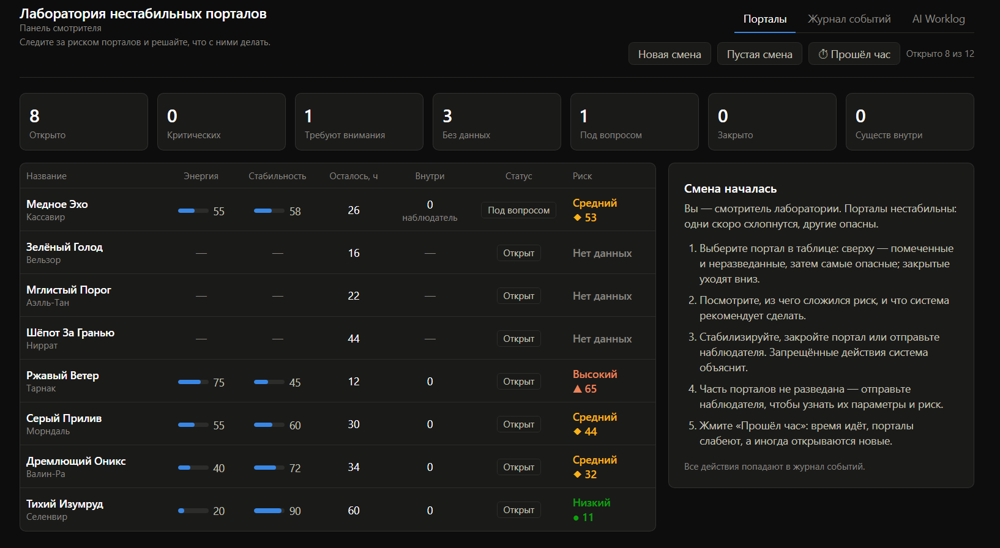
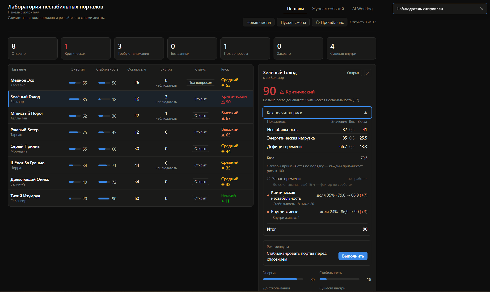
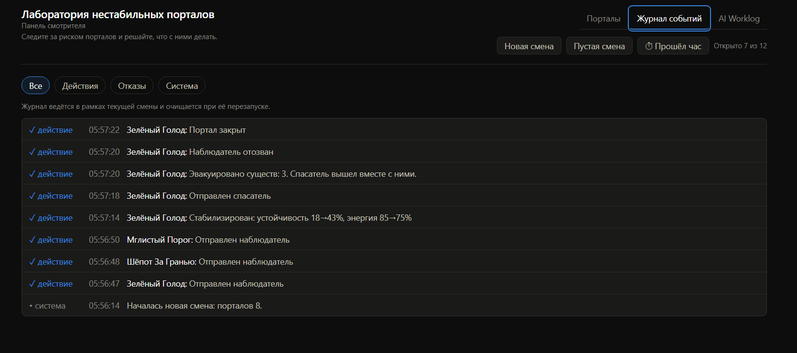

# Лаборатория нестабильных порталов

Панель смотрителя: список порталов, расчёт риска с объяснением, действия с
проверкой правил и журнал событий.

**Приложение:** https://portal-lab-one.vercel.app

Тестовое задание на вакансию AI-first Developer.

## Что посмотреть за минуту

1. Верхние строки таблицы это неразведанные порталы: параметры неизвестны,
   риск не считается. Выберите такой и нажмите «Отправить наблюдателя», данные
   появятся.
2. Разверните «Как посчитан риск»: база из трёх показателей, затем факторы,
   каждый со своей долей и переходом «было → стало».
3. Нажмите «Отправить спасателя» на портале с критическим риском. Действие
   заблокируется с объяснением, отказ попадёт в журнал.
4. Пройдите цепочку на портале с существами: разведка, стабилизация, спасатель,
   эвакуация, закрытие. Рекомендация ведёт по шагам.
5. Нажмите «Прошёл час» несколько раз: время идёт, порталы слабеют и
   схлопываются, иногда открываются новые.
6. «Пустая смена» это лаборатория без порталов, наполняется с нуля.

## Запуск

Нужен Node.js 18 или новее.

    npm install
    npm run dev      # http://localhost:5173
    npm test         # 45 тестов
    npm run build

Секретов, ключей и переменных окружения в проекте нет.

## Формула риска

Неразведанный портал: риск не считается. Закрытый: 0.

База из трёх нормированных показателей:

    база = 0,5 × (100 − стабильность)
         + 0,3 × энергия
         + 0,2 × дефицит времени         (дефицит = 100 − часы/48 × 100)

Затем факторы применяются по порядку. Каждый приближает риск к сотне на свою
долю оставшегося расстояния: `риск = риск + (100 − риск) × доля`.

| Фактор | Условие | Доля |
|---|---|---|
| Портал вот-вот схлопнется | ≤ 2 ч | 45% |
| Осталось меньше 6 часов | ≤ 6 ч | 20% |
| Критическая нестабильность | стабильность < 20 | 35% |
| Внутри живые | существа, наблюдатель, спасатель | 12–30% |

Уровни: до 30 низкий, до 60 средний, до 85 высокий, дальше критический.

Долевая схема выбрана намеренно. При жёстких потолках вида «риск не ниже 85»
действия пользователя переставали влиять на число: стабилизация не двигала
оценку. Здесь любое действие видно сразу.

## Действия и запреты

| Действие | Когда запрещено |
|---|---|
| Стабилизировать | портал закрыт; не разведан |
| Закрыть | уже закрыт (внутри живые: подтверждение) |
| Отправить наблюдателя | закрыт; уже внутри; риск критический |
| Отозвать наблюдателя | наблюдателя нет; портал закрыт |
| Отправить спасателя | закрыт; не разведан; уже внутри; существ нет; риск критический |
| Отозвать спасателя | спасателя нет; портал закрыт |
| Эвакуировать существ | закрыт; не разведан; существ нет; нет спасателя |
| Пометить «под вопросом» | портал закрыт |

Запрещённые кнопки остаются кликабельными: при нажатии показывают причину и
пишут отказ в журнал. Задизейбленная кнопка прятала бы логику, кликабельная её
показывает.

## Архитектура

    src/domain/   чистые функции, ничего не знают о React
    src/ui/       компоненты, бизнес-логики не содержат
    src/data/     статичные данные смены и содержимое Worklog
    src/test/     45 тестов в 7 файлах

Три решения, которые стоит знать.

**Правила живут в редьюсере, а не в интерфейсе.** Запрещённое действие не
меняет состояние, даже если вызвано в обход кнопки.

**Приложение детерминировано.** Нет локального хранилища, время двигается
только кнопкой, появление порталов идёт через генератор с фиксированным зерном.
Один и тот же сценарий разворачивается одинаково у всех.

**Скрытые данные не утекают.** Содержимое неразведанного портала не
раскрывается нигде: ни в сводке, ни в сообщении о схлопывании, ни в истории.

## Проверка

Автотесты покрывают формулу, правила, эффекты, генератор, сортировку и полную
цепочку спасательной операции: `npm test`.

Вручную проверены сценарии:

- [x] пустая смена: нули в сводке, заглушка вместо таблицы
- [x] портал с критическим риском
- [x] запрещённое действие: причина в тосте и отказ в журнале
- [x] изменение риска после стабилизации
- [x] журнал после серии операций
- [x] закрытие портала с существами: подтверждение, отмена ничего не меняет
- [x] неразведанный портал: разведка наблюдателем, затем полная цепочка
- [x] «Прошёл час»: схлопывание, появление новых порталов, лимит 12
- [x] ширина экрана 390, 1280 и 1920, без горизонтального скролла

## AI Worklog

Встроен в приложение, вкладка «AI Worklog». Там инструменты, этапы, принятые
решения, ошибки AI и что бы я доработал в реальном продукте.

Коммиты помечены соавторством Claude: код писал он, по моим брифам и с моей
приёмкой. Это осознанно и описано в Worklog.
